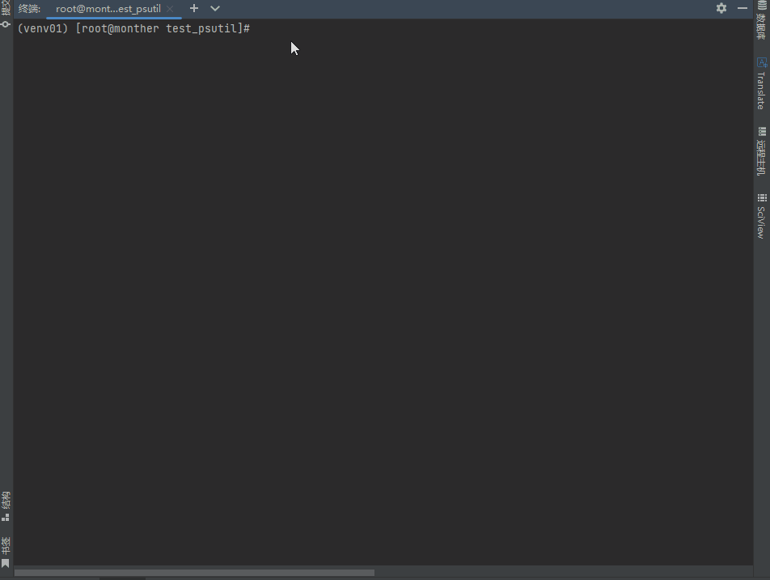

# Muti-Xray

> 下面的都能干，不能用就是作者太懒，还没写，快去踹他一脚催催他【提issue也行】。
> **接广告**


## 什么是Muti-Xray

Muti-Xray是一个具有操作系统高兼容性，节点大批量操作，高抗污染的站群服务器管理模型。因为目前GFW（长城防火墙）更新带学习功能的流量包筛选机制。本工具采用多ip来抗污染.
适用于 
- 全球ip代理池
- 在线直播场景
- 爬虫ip池
- 大型机场抗污染

## 安装

#### 安装代下载工具git

- RHEL/Debian:

```bash
source '/etc/os-release' ; [[ "${ID}" == "centos" ]] && yum install git -y || (apt-get update && apt-get install git -y)

```

- MacOS

看git官网： [https://git-scm.com/]( https://git-scm.com/)

#### 克隆代码

```bash
git clone https://github.com/Paper-Dragon/muti_xray.git
```

#### 进入操做系统准备阶段

```bash
cd muti_xray && bash prepare.sh run
```

#### 安装xray

```bash
python3 main.py install
```

#### 安装模式



```bash
python3 main.py config_init --name CCC-Node
```

## 升级

> 升级将会丢失所有的配置

```bash
python3 main.py install
```

## 调整参数

python3 main.py --help

```bash
(venv01) [root@monther project]# python3 main.py --help
usage: main.py [-h] [--list]
               {install,config_init,uninstall,status,show_config} ...

站群服务器隧道管理脚本

positional arguments:
  {install,config_init,uninstall,status,show_config}
                        选择进入子菜单功能
    install             安装/升级xray内核,注意！执行这一项全部配置将会丢失
    config_init         进行配置初始化并重载内核设置
    uninstall           从这个电脑上完全移除站群管理服务
    status              查看xray运行状态
    show_config         查看文件中的配置

optional arguments:
  -h, --help            show this help message and exit
  --list, -L            列出站群服务器内的所有节点


```

## 兼容性

### 操作系统兼容性

| 操作系统                                      | 兼容性                                 | 备注               |
| --------------------------------------------- | -------------------------------------- | ------------------ |
| CentOS/RHEL/Fedora                            | True                                   | 版本号大于7        |
| Ubuntu/Debian/Deepin/Mint                     | True                                   | 版本号大于16       |
| ~~Windows 7/Windows 8/Windows 10/Windows 11~~ | ~~理论可以，作者还没写，需要联系作者~~ | **快去催一下作者** |
| MacOS                                         | True                                   | 完全支持           |

### 支持的协议

#### V2ray

| 协议      | 支持情况                                             |
| --------- | ---------------------------------------------------- |
| VMess     | tcp, tcp+tls/xtls, ws, ws+tls/xtls, h2c, h2+tls/xtls |
| VMessAEAD | tcp, tcp+tls/xtls, ws, ws+tls/xtls, h2c, h2+tls/xtls |
| VLess     | tcp, tcp+tls/xtls, ws, ws+tls/xtls, h2c, h2+tls/xtls |
| VLite     | √                                                    |

#### Trojan

| 协议   | 支持情况 |
| ------ | -------- |
| Trojan | √        |

#### Shadowsocks

| 协议            | 支持情况 | 网络层协议 | 传输层协议 | 加密方法          |
| --------------- | -------- | ---------- | ---------- | ----------------- |
| ShadowsocksAEAD | √        | tcp        | tcp        | plain             |
|                 |    √         | tcp       | tcp        | aes-128-gcm       |
|                 |      √       | tcp      | tcp        | aes-256-gcm       |
|                 |     √        | tcp | tcp        | chacha20-poly1305或chacha20-ietf-poly1305 |
|                 |      √       | udp | tcp | plain |
|                 | √ | udp | tcp | aes-128-gcm |
|                 | √ | udp | tcp | aes-256-gcm |
|                 | √ | udp | tcp | chacha20-poly1305或chacha20-ietf-poly1305 |
|                 | √ | tcp+udp    | tcp          | plain                                     |
|                 | √ | tcp+udp | tcp | aes-128-gcm |
| | √ | tcp+udp | tcp | aes-256-gcm |
| | √ | tcp+udp | tcp | chacha20-poly1305或chacha20-ietf-poly1305 |
| | 未来支持 | ? | mkcp | ? |
| | 未来支持 | ? | WebSocket | ? |
| | 未来支持 | ? | HTTP | ? |
| | 未来支持 | ? | GRPC | ? |
| | 未来支持 | ? | QUIC | ? |
| | 未来支持 | ? | DomainSocket | ? |


#### Socks5

| 协议    | 支持协议    | 支持情况 |
| ------- | ----------- | -------- |
| Sockets | tcp,tcp+udp | √        |

### 数字证书

| 功能     | 支持情况 | 需要提供的参数              | 必须？                                    |
| -------- | -------- | --------------------------- | ----------------------------------------- |
| 证书加密 | 未来支持 | 服务器端证书的域名          | 可选                                      |
|          |          | ALPN 数值                   | 客户端和服务端一致                        |
|          |          | allowInsecure               | 是否允许不安全连接（仅用于客户端）。      |
|          |          | disableSystemRoot           | 禁用操作系统自带的 CA 证书                |
|          |          | verifyClientCertificate     | 验证客户端证书                            |
|          |          |                             |                                           |
| 数字证书 |          | certificate/certificateFile |                                           |
|          |          | key/keyFile                 |                                           |
|          |          | 验证方式                    | encipherment，verify，issue，verifyclient |
|          |          |                             |                                           |


## 为什么选择Muti-Xray

- 支持多协议
- 支持多ip
- 支持配置更多传输配置
- 更多高级功能请联系作者定制
- 支持多个公网ip批量操作
- 生成快捷链接发布到网页端
- 支持对生成quick link的txt文本保存


## 致谢：

- [Project X Community](https://github.com/XTLS)

- [Xray](https://github.com/XTLS/Xray-core)

## 注

#### 此脚本仅供交流学习使用，请勿使用此脚本行违法之事。网络非法外之地，行非法之事，必将接受法律制裁！！


## 有关作者你不知道的一切

- 宇宙中的光速本来是35km/h,PaperDragon花了两天优化。
- 有一次PaperDragon咬了一只猫,这只猫获得了超能力并且学会了Python。
- 当贝尔发明电话的时候,他在电话上看到一个PaperDragon的未接来电。
- 解释器不警告PaperDragon,PaperDragon警告解释器。
- PaperDragon可以心算MD5
- PaperDragon抄袭的代码从来没人看出过,他还总是在抄的时候骂骂咧咧,谁也不知道他在骂什么
- 如果你的代码被SIGPAPERFRAGON杀死,这段代码将永远不能再被运行。
- 在ENIAC诞生的那一天,工程师们在桌上发现一份写满了它无法运行的程序的笔记,落款是PaperDragon,多年后人们发现这份代码是一个手写的AI模型。
- PaperDragon没有提出过博弈论,因为没有人能和他博弈。
- PaperDragon找不到人写笑话,因为PaperDragon写完了所有的。